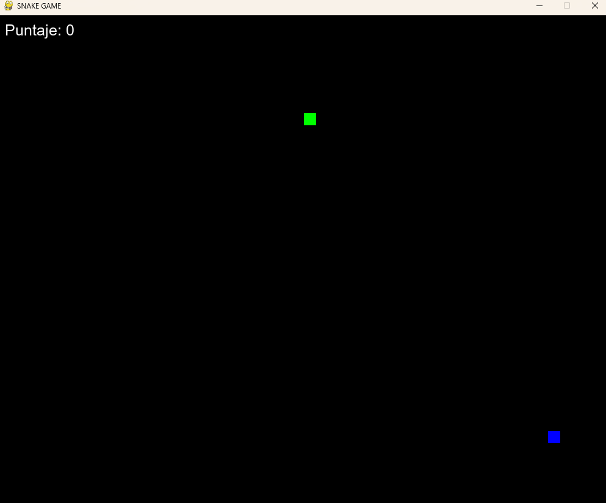

# Juego de la Serpiente en Python

Este es un clásico juego de la serpiente ("Snake Game") desarrollado en Python utilizando la biblioteca **Pygame**. En este juego, el jugador controla una serpiente que debe comer comida para crecer, mientras evita chocar contra las paredes o su propio cuerpo.

<p align="center">
  
</p>
## Características

- Juego clásico de la serpiente con controles de teclado.
- La serpiente crece al comer la comida.
- La velocidad del juego aumenta a medida que el jugador obtiene más puntos.
- Pantalla de "Game Over" que muestra el puntaje final y opciones para reiniciar o salir.

## Requisitos

Para ejecutar este juego, necesitas tener Python 3.x instalado junto con la biblioteca **Pygame**.

### Instalación de Pygame

Si no tienes **Pygame** instalado, puedes instalarlo ejecutando el siguiente comando:

```bash
pip install pygame
